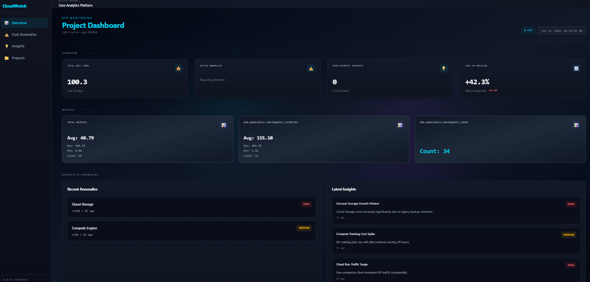
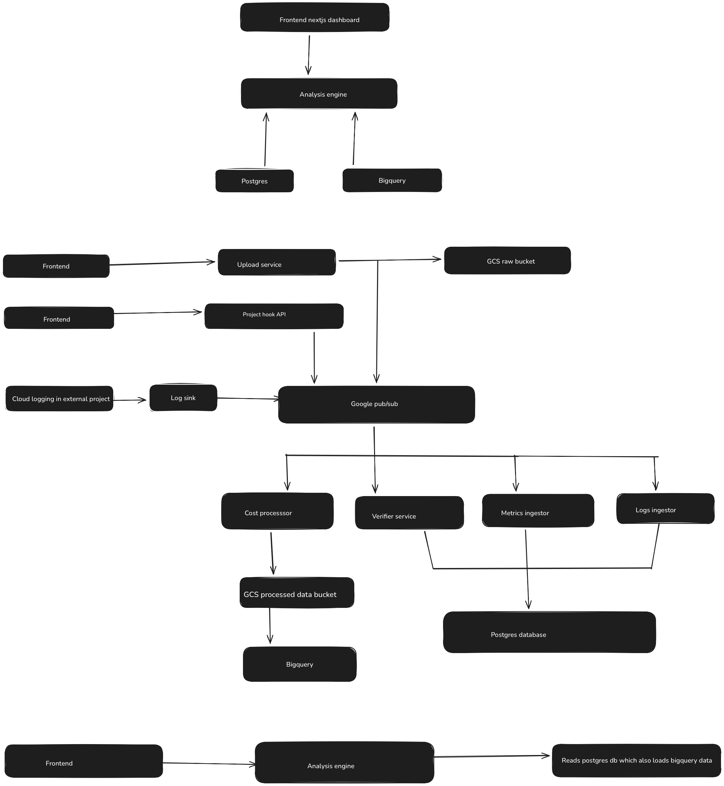

# Cloud Cost Resource Analyzer

A **cloud-native cost analytics platform** designed to ingest multi-project GCP metrics, process cost signals, detect anomalies, and expose actionable insights via a dashboard API.

Built with a **microservice architecture** on Google Cloud Run, the system demonstrates event-driven design, cost data processing, and scalable backend engineering patterns.

---

## 🚀 Problem Statement

Managing cloud costs across multiple GCP projects becomes increasingly complex as infrastructure scales. Native dashboards often lack centralized visibility, anomaly detection, and project-level insights.

## 📷 Dashboard Preview



---


**This project provides:**

- Multi-project onboarding  
- Centralized cost analysis  
- Anomaly detection  
- Dashboard-ready APIs  
- Event-driven cost processing pipeline  

---

## 🏗 Architecture Overview

The system follows a **microservice + event-driven architecture** deployed on Google Cloud.



### Core Flow

1. Projects are onboarded via the Upload Service.  
2. Metrics and cost signals are published via Pub/Sub.  
3. Cost Processor consumes events and processes cost data.  
4. Metrics Ingestor loads processed metrics into storage.  
5. Analysis Engine exposes aggregated data via REST APIs.  
6. Frontend Dashboard consumes analysis APIs.  

---

## 🧩 System Components

### 1️⃣ Upload Service
- Handles project onboarding  
- Publishes project events  
- Exposes Prometheus-style metrics endpoint  
- Deployed on Cloud Run  

### 2️⃣ Cost Processor
- Consumes Pub/Sub messages  
- Processes cost-related signals  
- Performs transformation & aggregation logic  

### 3️⃣ Metrics Ingestor
- Loads processed metrics into storage  
- Prepares data for analytical querying  

### 4️⃣ Analysis Engine
- Exposes REST APIs for:
  - `/dashboard`
  - `/anomalies`
  - `/insights`
  - `/projects`
  - `/add-project`
- Serves as the main backend interface for frontend  

### 5️⃣ Frontend Dashboard
- Displays:
  - Cost trends  
  - Request metrics  
  - Anomaly summaries  
  - Project insights  
- Connects directly to Analysis Engine APIs  

---

## 🛠 Tech Stack

**Backend**
- Python (FastAPI)  
- Google Cloud Run  
- Google Pub/Sub  
- PostgreSQL  

**Frontend**
- React  

**Infrastructure**
- Google Cloud Platform  
- Cloud Run (serverless deployment)  
- Pub/Sub (event-driven messaging)  
- Managed PostgreSQL  

---

## 📊 Key Features

- Multi-project onboarding  
- Event-driven cost processing  
- REST-based dashboard APIs  
- Cost anomaly detection  
- Modular microservice design  
- Prometheus-style observability endpoints  

---

## 🔍 Observability

All services expose **Prometheus-compatible metrics endpoints** for:

- Request count  
- Average latency  
- Error rates  

This enables integration with Prometheus + Grafana for production-grade monitoring.

---

## 🔄 Event-Driven Design

The system leverages **Google Pub/Sub** for asynchronous processing:

- Decoupled service communication  
- Scalable cost processing  
- Extensible pipeline for real-time analytics  

---

## 🧠 Design Considerations

- Microservice separation for modular scaling  
- Event-driven pipeline for loose coupling  
- API-first backend for frontend flexibility  
- Cloud-native deployment model  
- Stateless services with managed storage backend  

---

## 📦 Future Improvements

- Real-time multi-project metric ingestion  
- Prometheus + Grafana monitoring stack  
- Horizontal autoscaling policies  
- Multi-tenant RBAC  
- Cost forecasting models  
- Kubernetes migration for large-scale deployments  

---

# 🛠 Setup & Deployment Guide

## 🔐 Prerequisites

- Google Cloud account  
- gcloud CLI installed and authenticated  
- Terraform installed  
- Node.js (v18+)  
- Python 3.10+  

Authenticate with GCP:

```bash
gcloud auth login
gcloud config set project <YOUR_GCP_PROJECT_ID>

---

## 🔌 Enable Required APIs

```bash
gcloud services enable \
  run.googleapis.com \
  pubsub.googleapis.com \
  artifactregistry.googleapis.com \
  sqladmin.googleapis.com
```

---

## 🔑 Required IAM Roles

The deploying account must have the following roles:

- Cloud Run Admin  
- Pub/Sub Admin  
- Cloud SQL Admin  
- Service Account User  
- Artifact Registry Admin  
- Project IAM Admin  

### One-Click Role Grant (Development Only)

> ⚠️ This grants Owner access. Use only for development environments.

```bash
gcloud projects add-iam-policy-binding <YOUR_GCP_PROJECT_ID> \
  --member="user:YOUR_EMAIL" \
  --role="roles/owner"
```

---

## 🌍 Infrastructure Deployment (Terraform)

Navigate to infrastructure directory:

```bash
cd cloud-cost-resource-analyzer/infra
```

Initialize Terraform:

```bash
terraform init
```

Preview infrastructure changes:

```bash
terraform plan
```

Apply infrastructure:

```bash
terraform apply
```

This provisions:

- Cloud Run services  
- Pub/Sub topics & subscriptions  
- PostgreSQL instance  
- Required IAM bindings  

---

## 🐳 Service Deployment (If Not Automated)

Build container image:

```bash
gcloud builds submit --tag gcr.io/<PROJECT_ID>/upload-service
```

Deploy to Cloud Run:

```bash
gcloud run deploy upload-service \
  --image gcr.io/<PROJECT_ID>/upload-service \
  --region us-central1
```

Repeat for:

- `cost-processor`  
- `metrics-ingestor`  
- `analysis-engine`  

---

## 🖥 Running Frontend Locally

Navigate to frontend:

```bash
cd frontend
```

Install dependencies:

```bash
npm install
```

Start development server:

```bash
npm run dev
```

Ensure the frontend API base URL points to the deployed **Analysis Engine** service.

---

## 📡 Accessing Services

List deployed services:

```bash
gcloud run services list --region us-central1
```

Test Analysis Engine endpoint:

```bash
curl https://<ANALYSIS_ENGINE_URL>/dashboard
```

---

## 🧹 Cleanup (Avoid Ongoing Charges)

```bash
cd infra
terraform destroy
```

---

## 👨‍💻 Author

**Aman Pandey**

Backend-focused engineer with strong interest in cloud-native systems, distributed architecture, and event-driven backend design.